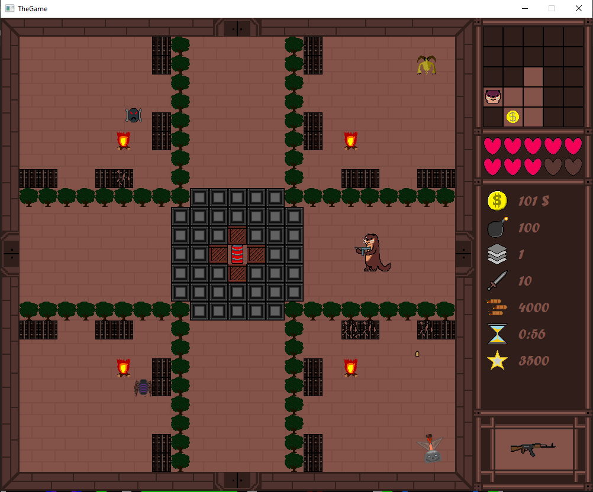

# The Mad Otter
> Rougelike type game with shooting elements
## Table of Contents
* [General Info](#general-information)
* [Technologies Used](#technologies-used)
* [Features](#features)
* [Screenshots](#screenshots)
* [Setup](#setup)
* [Acknowledgements](#acknowledgements)

## General Information

In order to escape from the dungeon you as a "Mad Otter" must defeat various enemies, avoid traps and look for new weapons and powerups.

Project was created in cooperation with Dawid Kwapisz (https://github.com/dkwapisz) as a university project.

## Technologies Used
- JavaFx - version 15.0.1
- FXML

## Features
List the ready features here:
- 15 weapons like shotgun, poison daggers and many more
- various enemies (following the player, creating copies of them themselvses when destroyed and more)
- randomly generated map
- time-limited powerups
- static objects destruction with bombs and explosions

## Screenshots

## Setup
1.File -> Project Structure -> Libraries -> Add (+) -> javafx-sdk-15.0.1/lib -> OK

2.File -> Project Structure -> Modules -> lib -> OK

3.Run -> Edit configuration -> VM options and paste:

Windows: --module-path "..\TheGame\javafx-sdk-15.0.1\lib" --add-modules javafx.controls,javafx.fxml

## Acknowledgements
Give credit here.
- This project was inspired by "The Binding of Isaac"
- Movenemnt handling was based on https://github.com/ashish2199/Aidos
